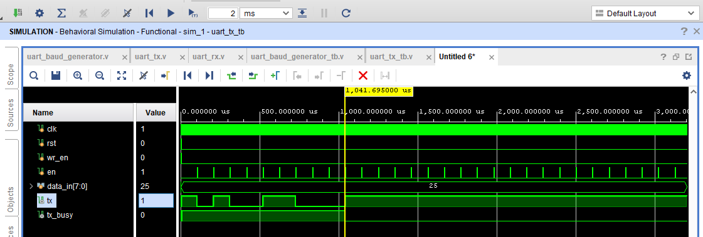
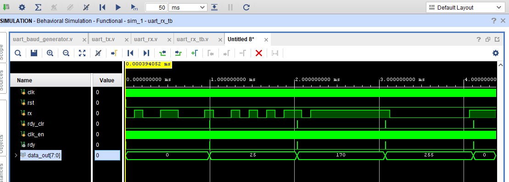
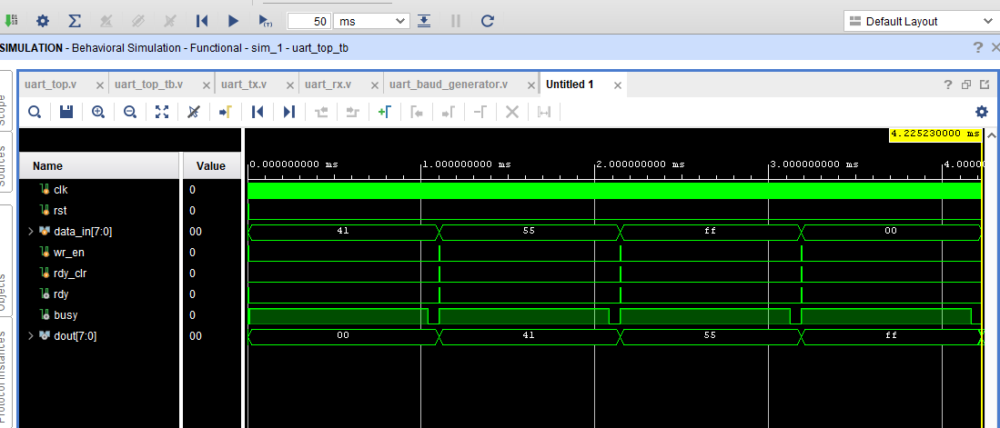

# 🚀 UART Controller in Verilog


---

## 📌 Overview

This project implements a **UART (Universal Asynchronous Receiver Transmitter)** in Verilog, including both **transmission and reception**, with a **baud rate generator** and **16x oversampling receiver**.

The design is fully verified using a **self-checking testbench** and validated through a **loopback system (TX → RX)**.

---

## 🧠 Features

* ✔ UART Transmitter (TX)
* ✔ UART Receiver (RX) with 16x oversampling
* ✔ Baud Rate Generator (9600 baud @ 100 MHz)
* ✔ Loopback Integration (TX → RX)
* ✔ Self-checking Testbench (PASS/FAIL)
* ✔ Ready/Busy Handshake Logic

---

## 🏗️ Architecture

```
uart_top
 ├── uart_baud_generator
 ├── uart_tx
 └── uart_rx
```

---

## ⚙️ Specifications

* Clock Frequency: 100 MHz
* Baud Rate: 9600
* Data Bits: 8
* Stop Bits: 1
* Parity: None
* Oversampling: 16x

---

## 🔄 Data Flow

1. Data is applied using `data_in` with `wr_en`
2. TX serializes data and transmits
3. RX samples incoming data using 16x clock
4. Data is reconstructed and validated
5. `rdy` signal indicates valid received data

---

## 🧪 Verification

* Self-checking testbench with PASS/FAIL logs
* Loopback testing (TX → RX)

### ✔ Test Cases

* 0x41 ('A')
* 0x55
* 0xFF
* 0x00

---

## 📷 Waveforms

### 🔹 UART TX



---

### 🔹 UART RX



---

### 🔹 UART Top (Loopback)



---

## 📁 Project Structure

```
UART_Controller/
│── rtl/
│── tb/
│── sim/
│── README.md
│── uart_tx_waveform.png
│── uart_rx_waveform.png
│── uart_top_waveform_using_verilog.png
```

---

## 🚀 Future Improvements

* FIFO Integration (TX/RX buffering)
* Parity Bit Support
* Configurable Baud Rate
* AXI/APB Interface

---

## 📌 Key Learnings

* UART protocol implementation
* FSM-based RTL design
* 16x oversampling technique
* Self-checking verification
* System-level integration

---

## 🔗 Author
Virupakshayya Hiremath