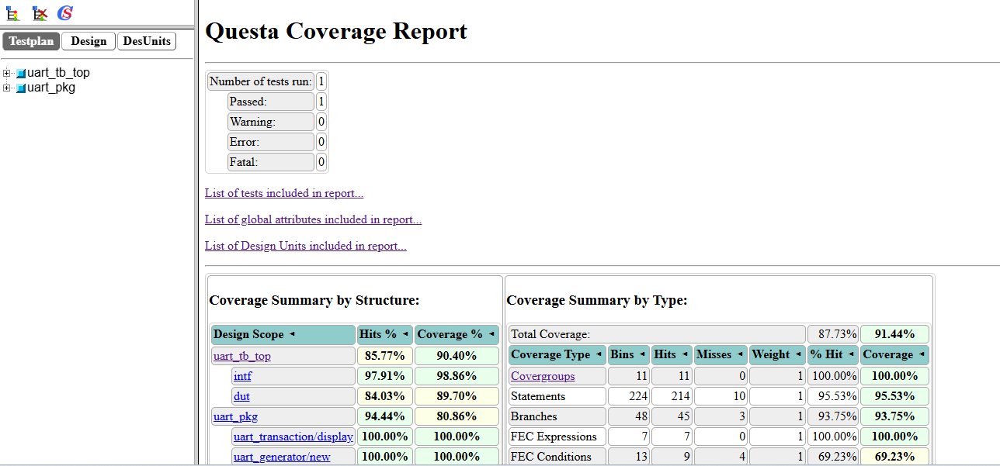
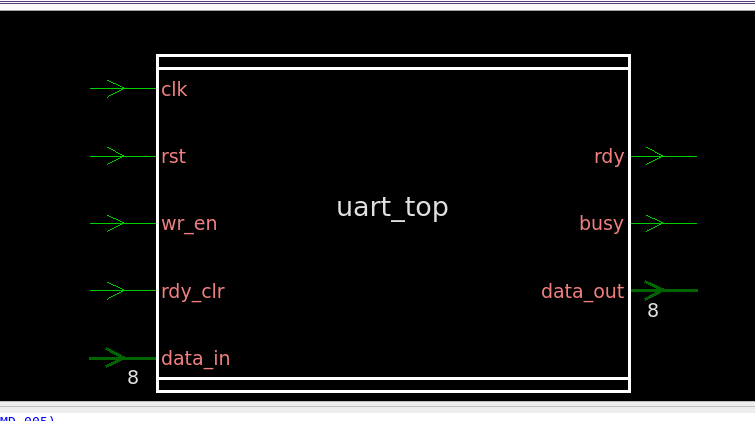

# UART Protocol Design and Verification

<p align="center">


</p>

---

# Overview

This project presents the complete **RTL Design** and **SystemVerilog Verification** of a **Universal Asynchronous Receiver Transmitter (UART)**.

The UART is implemented in **Verilog HDL** and verified using a reusable **SystemVerilog self-checking verification environment**. The verification environment includes constrained-random stimulus generation, driver, monitor, reference model, scoreboard, and functional coverage to validate UART transmit and receive functionality.

The project also includes:

- RTL Design
- Functional Verification
- Functional Coverage
- RTL Synthesis
- Simulation Waveforms
- Coverage Report
- Simulation Automation using QuestaSim

---

# Features

## RTL Design

- UART Transmitter
- UART Receiver
- Baud Rate Generator
- UART Top Module
- 8-bit Data Transmission
- Parameterized Baud Rate
- Start Bit Generation
- Stop Bit Generation
- Serial-to-Parallel Conversion
- Parallel-to-Serial Conversion

---

## Verification Features

A reusable layered SystemVerilog verification environment has been developed.

Implemented Components

- Interface
- Transaction Class
- Generator
- Driver
- Monitor
- Reference Model
- Scoreboard
- Functional Coverage
- Environment
- Test
- Package

Verification Features

- Self-checking Testbench
- Mailbox Communication
- Random Transaction Generation
- Automatic DUT Output Checking
- Functional Coverage Collection

---

# UART Architecture

```
                +----------------------+
                | Baud Generator       |
                +----------+-----------+
                           |
                           |
            +--------------+--------------+
            |                             |
            |                             |
    +-------v-------+             +-------v-------+
    | UART TX       |             | UART RX       |
    +-------+-------+             +-------+-------+
            |                             |
            +-------------+---------------+
                          |
                    UART TOP MODULE
```

---

# Verification Architecture

```
                 +------------------+
                 |    Generator     |
                 +---------+--------+
                           |
                           v
                 +------------------+
                 |      Driver      |
                 +---------+--------+
                           |
                           v
                    +--------------+
                    |   UART DUT   |
                    +------+-------+
                           |
               +-----------+-----------+
               |                       |
               v                       v
        +-------------+        +---------------+
        |   Monitor   |        | Functional    |
        |             |        | Coverage      |
        +------+------+        +---------------+
               |
               v
      +----------------------+
      | Reference Model      |
      +----------+-----------+
                 |
                 v
         +---------------+
         | Scoreboard    |
         +---------------+
```

---

# Repository Structure

```
uart-protocol
│
├── rtl/
│   ├── uart_baud_generator.v
│   ├── uart_tx.v
│   ├── uart_rx.v
│   ├── uart_top.v
│
├── sv_tb/
│   ├── uart_if.sv
│   ├── uart_transaction.sv
│   ├── uart_generator.sv
│   ├── uart_driver.sv
│   ├── uart_monitor.sv
│   ├── uart_ref_model.sv
│   ├── uart_scoreboard.sv
│   ├── uart_env.sv
│   ├── uart_test.sv
│   ├── uart_pkg.sv
│   └── uart_tb_top.sv
│
├── sim/
│
├── sim_questa/
│   ├── run.do
│   └── coverage_report/
│
├── images/
│   ├── coverage_report.png
│   ├── lint_report.png
│   ├── schematic.png
│   ├── synthesis_schematic_1.png
│   ├── synthesis_schematic_2.png
│   ├── uart_baud_generator_waveform.png
│   ├── uart_rx_waveform.png
│   ├── uart_tx_waveform.png
│   └── uart_top_waveform_using_verilog.png
│
├── README.md
└── .gitignore
```

---

# RTL Modules

| Module | Description |
|---------|-------------|
| uart_baud_generator | Generates baud tick from system clock |
| uart_tx | Converts parallel data into serial data |
| uart_rx | Converts serial data into parallel data |
| uart_top | Integrates TX, RX and Baud Generator |

---

# Verification Components

| Component | Purpose |
|-----------|----------|
| Interface | Connects DUT and Testbench |
| Transaction | Stores UART transaction data |
| Generator | Generates randomized transactions |
| Driver | Drives transactions to DUT |
| Monitor | Captures DUT activity |
| Reference Model | Generates expected UART behavior |
| Scoreboard | Compares expected and actual outputs |
| Functional Coverage | Measures verification completeness |
| Environment | Connects all verification components |
| Test | Controls complete verification flow |

---

# Simulation Flow

```
Compile RTL
      │
      ▼
Compile Testbench
      │
      ▼
Generate Random Transactions
      │
      ▼
Driver
      │
      ▼
UART DUT
      │
      ▼
Monitor
      │
      ▼
Reference Model
      │
      ▼
Scoreboard
      │
      ▼
Coverage Collection
```

---

# Functional Coverage Results

| Coverage Type | Result |
|---------------|--------|
| Overall Coverage | **91.44%** |
| Functional Coverage | **100%** |
| Statement Coverage | **95.53%** |
| Branch Coverage | **93.75%** |
| Expression Coverage | **100%** |
| Condition Coverage | **69.23%** |

---

# Coverage Report



A complete HTML coverage report generated using **QuestaSim** is available in:

```
sim_questa/coverage_report/
```

---

# Simulation Waveforms

## UART Transmitter


---

## UART Receiver


---

## Baud Generator


---

## UART Top Simulation


---

# RTL Synthesis

RTL synthesis was performed using **Synopsys Design Compiler**.

### Schematic



---

# Tools Used

| Tool | Purpose |
|------|---------|
| Verilog HDL | RTL Design |
| SystemVerilog | Verification |
| QuestaSim | Simulation & Coverage |
| Synopsys Design Compiler | RTL Synthesis |
| Git | Version Control |
| GitHub | Repository Hosting |

---

# Running the Simulation

Compile and run using QuestaSim:

```bash
vsim -do sim_questa/run.do
```

or from the QuestaSim console:

```tcl
do sim_questa/run.do
```

The script performs the following:

- Creates work library
- Compiles RTL modules
- Compiles SystemVerilog verification environment
- Starts simulation
- Executes all test cases
- Saves coverage database
- Generates HTML coverage report

---

# Key Learning Outcomes

Through this project, I gained hands-on experience in:

- RTL design using Verilog HDL
- UART protocol implementation
- Layered SystemVerilog verification methodology
- Constrained-random stimulus generation
- Self-checking verification environment
- Functional coverage collection and analysis
- Reference model development
- Scoreboard-based verification
- RTL synthesis using Synopsys Design Compiler
- Simulation automation using QuestaSim

---

# Future Enhancements

- UVM-based verification environment
- SystemVerilog Assertions (SVA)
- UART Parity Support
- Configurable Data Width
- Configurable Stop Bits
- Error Injection Test Cases
- Regression Automation
- Continuous Integration (CI)

---

# Author

**Virupakshayya Hiremath**

Electronics and Communication Engineering

Interested in:

- RTL Design
- Design Verification
- ASIC Front-End Design
- FPGA Design

**GitHub**

https://github.com/Virupakshayyahiremath

**LinkedIn**

https://www.linkedin.com/in/virupakshayya/
---

⭐ If you found this project helpful, consider giving it a star!